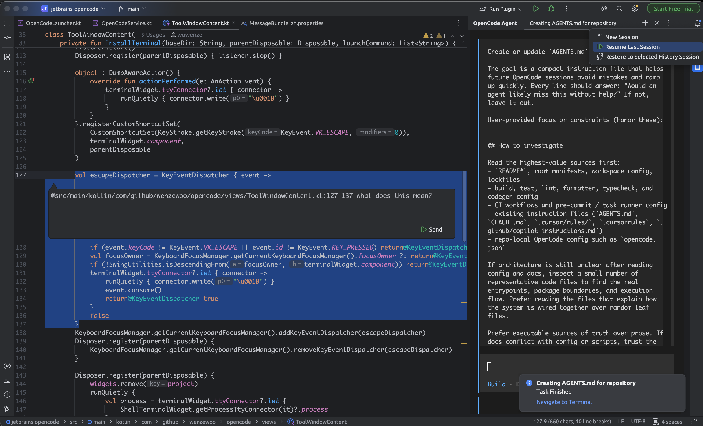

# OpenCode Agent
OpenCode Agent is an IntelliJ IDEA plugin that integrates [OpenCode](https://github.com/anomalyco/opencode) — a context-aware AI coding assistant CLI — directly into your IDE.



## Features

- **Terminal-based AI Sessions** — Run, resume, fork, and browse OpenCode sessions in IDE terminal tabs
- **Inline Chat** — Open a lightweight chat popup from the editor (`Alt+Enter` → "Open Inline Chat") to send prompts with automatic file references
- **File References** — Send file paths (with line numbers) to OpenCode from the project view or editor context menu
- **Event-driven VFS Sync** — File edits made by AI are automatically detected and the IDE virtual file system is refreshed in real-time via SSE
- **Permission Notifications** — Get notified when OpenCode requests file access or command execution permissions
- **Multiple Sessions** — Manage multiple OpenCode sessions in parallel tabs, each with its own terminal

## Requirements

- IntelliJ IDEA 2025.3+
- [OpenCode](https://github.com/anomalyco/opencode) CLI installed and available in `PATH`

## Installation

1. Install the plugin from [JetBrains Marketplace](https://plugins.jetbrains.com)
2. Ensure `opencode` is installed: `curl -fsSL https://opencode.ai/install.sh | sh`
3. (Optional) Configure the binary path in **Settings → Tools → OpenCode Agent** if it's not in `PATH`

## Usage

### Tool Window
Open the **OpenCode Agent** tool window from the right sidebar. Use the **+** button to start a new session, resume the last session, fork the current session, or browse session history.

### Inline Chat
In any editor, press `Alt+Enter` and select **Open Inline Chat**, or right-click and choose **Open Inline Chat**. Type your prompt and press `Shift+Enter` to send it to an OpenCode terminal.

### File References
- **Project View**: Right-click a file → **Send File Ref**
- **Editor**: Right-click → **Send File Ref** (includes selected line range)

## Configuration

| Setting | Description |
|---------|-------------|
| Binary path | Path to the `opencode` executable; leave empty for auto-detection |
| Tool window mode | `DOCKED` (sidebar), `SLIDING` (auto-hide), `FLOATING`, or `WINDOWED` |

## Build

```bash
./gradlew build
```

## Publishing

```bash
./gradlew publishPlugin
```

## License

MIT
